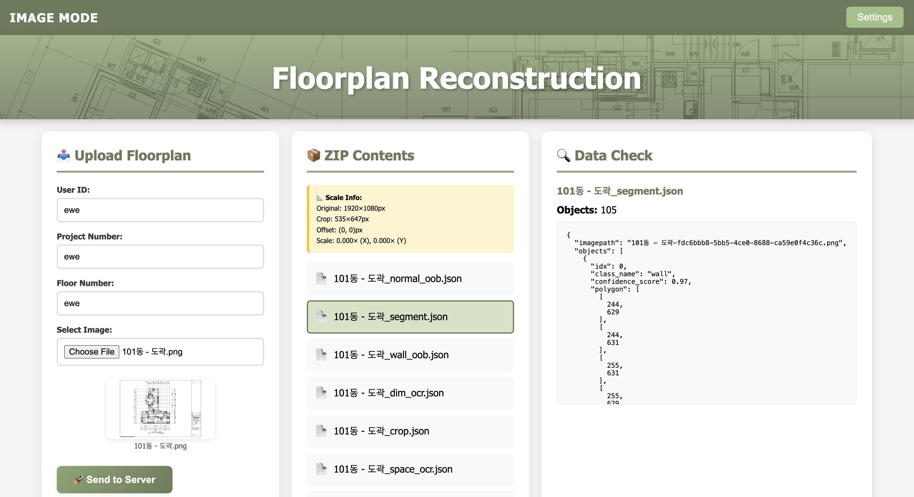
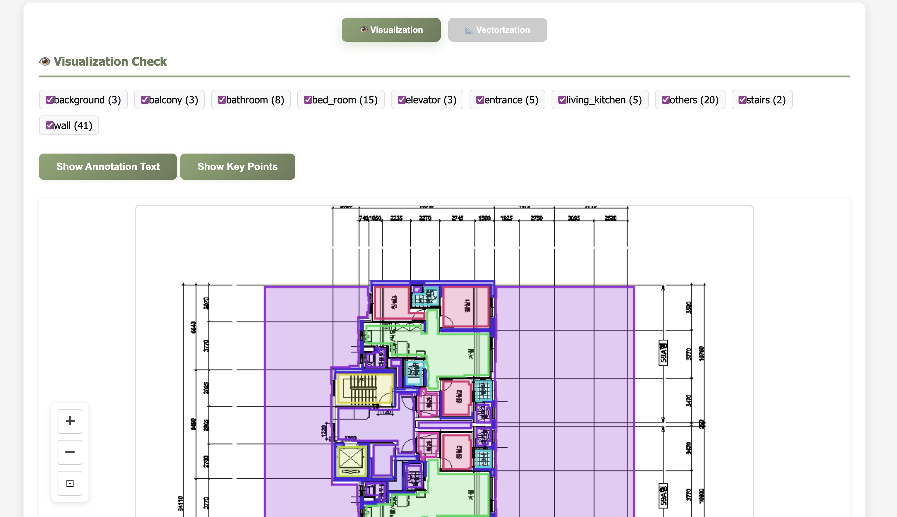

# 🏗️ Floorplan Visualizer


A modern web-based application for uploading floorplan images, receiving AI-powered analysis results, and visualizing detected architectural elements with interactive features.

---

## 📸 Screenshots

### Web Interface

*Glimpse of the web application interface*

### Visualization Mode

*Interactive floorplan visualization with detected elements*

---

## ✨ Features

### 🎨 Beautiful User Interface
- **Light Olive Theme** - Professional and easy on the eyes
- **Animated GIF Placeholders** - Engaging loading states while processing
- **Responsive Design** - Works seamlessly on different screen sizes
- **Three-Panel Layout** - Upload, Data Contents, and Data Check sections

### 📤 Image Mode (Active)
- **Drag & Drop Upload** - Easy floorplan image upload
- **Real-time Progress** - Visual progress bar during upload
- **Smart ZIP Extraction** - Automatic extraction and file listing
- **Interactive Data Viewer** - Browse JSON files, images, and text files
- **Advanced Visualization** - Annotated overlay with detected objects
- **Vectorization View** - CAD-style vector representation
- **Zoom & Pan** - Full control over visualization canvas
- **Class Filtering** - Toggle visibility of different object types

### 🎬 Loading Animations
- **Man & Robot GIF** - Shows while processing ZIP contents
- **Live Chatbot GIF** - Displays during data analysis
- **Loader Cat GIF** - Appears while preparing visualization

### 📊 Visualization Tools
- Bounding boxes with color-coded classes
- Key points and polygon overlays
- Dimension area detection
- OCR text display (dimensions, symbols, spaces)
- Annotation text toggle
- Export capabilities

---

## 🚀 Getting Started

### Prerequisites
- Modern web browser (Chrome, Firefox, Edge, Safari)
- Python 3.7+ (for backend server, if needed)
- FastAPI server running (for processing)

### Installation

1. **Clone or download this repository**
   ```bash
   git clone <repository-url>
   cd web_gui
   ```

2. **No build required!** - This is a static web application

3. **Open in browser**
   ```bash
   # Simply open index.html in your browser
   # Or use a local server:
   python -m http.server 8000
   ```

4. **Configure Server Settings**
   - Click the "Settings" button in the menu bar
   - Enter your FastAPI server IP and port
   - Default: `127.0.0.1:5000`

---

## 📖 How to Use

### Step 1: Upload Your Floorplan
1. Open `index.html` in your browser
2. Fill in project details:
   - User ID (e.g., `sd_test`)
   - Project Number (e.g., `PRJ-1`)
   - Floor Number (e.g., `floor_1`)
3. Select your floorplan image
4. Click "🚀 Send to Server"

### Step 2: Watch the Magic Happen
- **GIF animations** will show while processing
- Progress bar tracks upload status
- ZIP file downloads automatically

### Step 3: Explore Your Results
- **ZIP Contents Panel** - Lists all extracted files
- **Data Check Panel** - View JSON data and images
- **Visualization Panel** - Interactive annotated view

### Step 4: Interact with Visualization
- **Scroll** to zoom in/out
- **Drag** to pan around
- **Toggle classes** to show/hide object types
- **Switch views** between Visualization and Vectorization modes
- **Toggle text** and key points on/off

---

## 🗂️ Project Structure

```
web_gui/
├── index.html                      # Main application (Image Mode)
├── dwg_mode.html                   # DWG Mode (Coming Soon)
├── twarch_mode.html                # TwArch Mode (Coming Soon)
├── README.md                       # This file
│
├── app/
│   ├── assets/                     # GIF animations
│   │   ├── man and robot working.gif
│   │   ├── Live chatbot.gif
│   │   └── Loader cat.gif
│   │
│   ├── img/                        # Images and icons
│   │
│   ├── src/
│   │   ├── image_mode/            # Image Mode scripts
│   │   │   ├── gif_animation/     # GIF loading controller
│   │   │   ├── vectorize/         # Vectorization features
│   │   │   ├── menu.js            # Settings modal
│   │   │   ├── upload.js          # File upload handler
│   │   │   ├── zip.js             # ZIP extraction
│   │   │   ├── json_file_viewer.js # Data viewer
│   │   │   ├── viz_render.js      # Visualization renderer
│   │   │   └── viewer_ui.js       # UI interactions
│   │   │
│   │   ├── dwg_mode/              # DWG Mode scripts
│   │   └── twarch_mode/           # TwArch Mode scripts
│   │
│   └── style/
│       ├── common.css             # Shared styles
│       ├── vector.css             # Vectorization styles
│       └── gif.css                # GIF placeholder styles
```

---

## 🎯 Modes

### ✅ Image Mode (Active)
Upload floorplan images and visualize AI-detected architectural elements including:
- Walls, doors, windows
- Rooms and spaces
- Dimensions and annotations
- Symbols and fixtures

### 🚧 DWG Mode (Coming Soon)
Direct processing of AutoCAD DWG files with:
- CAD layer analysis
- Native vector data extraction
- Enhanced precision visualization

### 🚧 TwArch Mode (Coming Soon)
Advanced architectural reasoning with:
- 3D CAD relations
- Structural analysis
- Multi-floor coordination

---

## ⚙️ Configuration

### Server Settings
Access via the "Settings" button in the menu bar:
- **Mode Selection** - Switch between Image/DWG/TwArch modes
- **Server IP** - Your FastAPI backend IP address
- **Port** - Backend server port (default: 5000)

Settings are saved in browser localStorage and persist across sessions.

---

## 🎨 Customization

### Styling
All styles are in `app/style/`:
- `common.css` - Main theme colors and layout
- `gif.css` - Loading animation styles
- `vector.css` - Vectorization view styles

### GIF Placeholders
Replace GIFs in `app/assets/` to customize loading animations:
- Data Content: `man and robot working.gif`
- Data Check: `Live chatbot.gif`
- Visualization: `Loader cat.gif`

---

## 🔧 Troubleshooting

### GIFs Not Showing
- Check file paths match exactly (case-sensitive)
- Ensure GIF files are in `app/assets/` folder
- Verify file names don't have special characters

### Upload Fails
- Verify server IP and port in Settings
- Check if FastAPI server is running
- Ensure server endpoint is `/receive_data`

### Visualization Not Appearing
- Wait for ZIP extraction to complete
- Click on a JSON file in ZIP Contents
- Check browser console for errors

### CORS Errors
- Ensure FastAPI server has CORS middleware enabled
- Use same protocol (http/https) for both frontend and backend

---

## 🚀 Future Work

- [ ] **DWG Mode** - Native AutoCAD file support
- [ ] **TwArch Mode** - Advanced architectural analysis
- [ ] **Multi-file Upload** - Batch processing
- [ ] **Export Options** - PDF, PNG, SVG export
- [ ] **Annotation Editing** - Manual corrections
- [ ] **Comparison Mode** - Side-by-side view
- [ ] **Cloud Storage** - Save projects online
- [ ] **Collaboration** - Share visualizations

---

## 📄 License

Personal Project

---

## 📧 Contact

**For Development Inquiries:**  
📩 personal@INc.

---

**Made with ❤️ for Floorplan Analysis**
